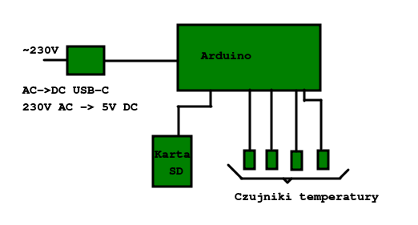

# Intro

This is a repository containing resources for my enviroumental physics project.

# Goals

The main goal of this project is to compare various types of thermal sensors in terms of their accuracy.

The expected result of the experiment is a decent set of data obtained automatically with a microcontroller setup.

